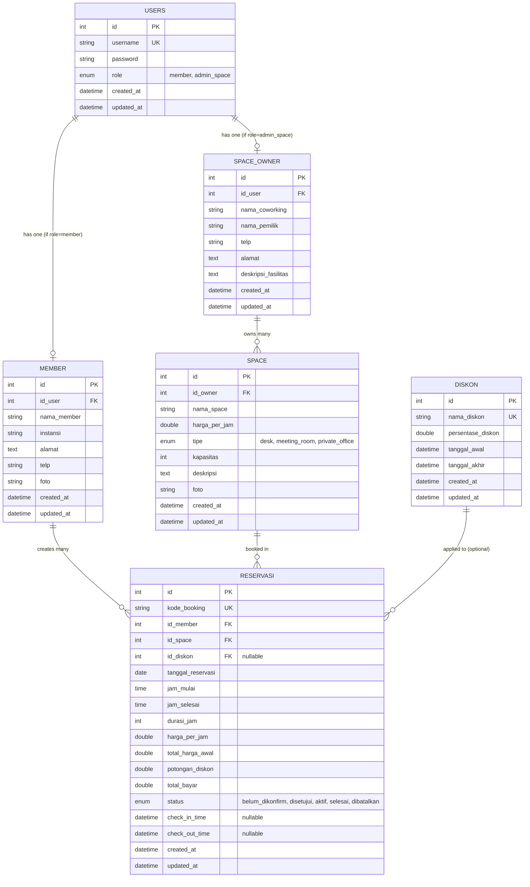

# PRODUCT REQUIREMENT DOCUMENT (PRD)
## Smart Space Booking – Aplikasi Reservasi Coworking Space & Workstation (Fullstack)
**Paket Ujian Kompetensi Keahlian (UKK) RPL 2026/2027 – Paket B**

---

## 1. Ringkasan Eksekutif & Informasi Dokumen

### 1.1 Judul & Identitas Proyek
- **Judul Proyek**: Smart Space Booking (Aplikasi Reservasi Coworking Space & Workstation)
- **Paket Soal**: UKK RPL 2026/2027 – Paket B
- **Kategori Pengerjaan**: **Fullstack Web Application** (Server-Side Rendering / Modern Monolith Fullstack dengan Basis Data & Business Logic mandiri)
- **Target Pengguna**: 
  1. **Member / Pengunjung**: Freelancer, mahasiswa, startup founder, remote worker, profesional.
  2. **Admin Pengelola Space**: Manajemen operasional coworking space, resepsionis / front desk, owner space.
- **Tujuan Utama Proyek**: Menyediakan platform penyewaan meja (Personal Desk), ruang rapat (Meeting Room), dan kantor privat (Private Office) secara online, transparan, bebas bentrok jadwal (*conflict-free booking*), dilengkapi e-ticket QR Code otomatis, alur check-in/check-out real-time, serta analitik pendapatan bulanan komprehensif.

---

## 2. Arsitektur Sistem & Rekomendasi Tech Stack

Aplikasi ini dikembangkan sebagai sistem **Fullstack** yang mandiri (mengelola basis data sendiri, melayani antarmuka pengguna responsif, dan menyediakan REST API internal sesuai standar UKK Paket B).

### 2.1 Arsitektur Aplikasi
```
+-----------------------------------------------------------------------+
|                         CLIENT LAYER (BROWSER)                       |
|   - Member Portal: Katalog, Booking Engine, My Booking, E-Ticket QR   |
|   - Admin Dashboard: Master Data, Scanner/Check-In, Revenue Chart     |
+-----------------------------------------------------------------------+
                                  |
                                  v  HTTP / HTTPS / REST JSON
+-----------------------------------------------------------------------+
|                    APPLICATION & BACKEND CONTROLLER                   |
|   - Auth & Role Middleware (Member vs Admin Space)                   |
|   - Availability & Overlap Checker Engine                             |
|   - Promo & Calculation Engine                                        |
|   - Check-in / Check-out & QR Verification Service                   |
|   - Monthly Financial Reporting & Analytics Service                   |
+-----------------------------------------------------------------------+
                                  |
                                  v  ORM / SQL Queries
+-----------------------------------------------------------------------+
|                      DATABASE & FILE STORAGE LAYER                    |
|   - Relational Database: MySQL 8.0+ / PostgreSQL                      |
|   - Local Upload Storage: /uploads/spaces/, /uploads/members/         |
+-----------------------------------------------------------------------+
```

### 2.2 Pilihan Tech Stack
Untuk mendapatkan performa maksimal, estetika visual modern, dan kemudahan pengujian saat UKK:
- **Pilihan Utama (Modern Node/TypeScript Fullstack)**:
  - **Framework**: **Next.js (App Router, Server Actions / Route Handlers)** atau **Laravel 11 (Blade + Tailwind / Vue Inertia)**.
  - **Bahasa**: TypeScript / PHP 8.2+.
  - **Database**: **MySQL 8.0+** / MariaDB.
  - **ORM / Query Builder**: Prisma ORM / Eloquent ORM.
  - **Styling UI**: Modern CSS / Vanilla CSS dengan CSS Custom Properties (Glassmorphism, Dark/Light Mode adaptif, Google Fonts *Plus Jakarta Sans / Inter*).
  - **Komponen Pendukung**:
    - QR Code Generator: `qrcode` (Node) / `simple-qrcode` (PHP).
    - QR Code Scanner: `html5-qrcode` untuk kamera front desk saat check-in.
    - Chart & Analitik: `Chart.js` / `ApexCharts` untuk visualisasi grafik pendapatan per bulan dan per tipe space.
    - Autentikasi: JWT (JSON Web Token) dengan HTTP-only Cookies / Session Auth + `bcrypt` password hashing.
    - File Upload: Form-data handling ke direktori lokal `/uploads` dengan validasi MIME-type gambar (JPEG, PNG, WEBP, max 2MB).

---

## 3. Desain Basis Data (ERD & Data Dictionary)

Berdasarkan ERD resmi Soal UKK Paket B Bagian II halaman 4, skema basis data dirancang dengan normalisasi tingkat 3 (3NF) dan integritas referensial penuh (*foreign keys with cascade / restrict rules*).



### 3.1 Rincian Entitas & Kolom Basis Data

#### 1. Tabel `users`
| Nama Kolom | Tipe Data | Constraint | Keterangan |
|---|---|---|---|
| `id` | INT AUTO_INCREMENT | PRIMARY KEY | ID unik akun autentikasi |
| `username` | VARCHAR(50) | UNIQUE, NOT NULL | Username login (case-insensitive) |
| `password` | VARCHAR(255) | NOT NULL | Hash password menggunakan Bcrypt (min. cost 10) |
| `role` | ENUM('member', 'admin_space') | NOT NULL | Hak akses sistem |
| `created_at` | DATETIME | DEFAULT CURRENT_TIMESTAMP | Waktu pendaftaran |
| `updated_at` | DATETIME | ON UPDATE CURRENT_TIMESTAMP | Waktu pembaruan data |

#### 2. Tabel `space_owner`
| Nama Kolom | Tipe Data | Constraint | Keterangan |
|---|---|---|---|
| `id` | INT AUTO_INCREMENT | PRIMARY KEY | ID profil pengelola |
| `id_user` | INT | FOREIGN KEY -> `users(id)` ON DELETE CASCADE | Relasi ke akun user admin |
| `nama_coworking` | VARCHAR(100) | NOT NULL | Nama brand coworking space |
| `nama_pemilik` | VARCHAR(100) | NOT NULL | Nama lengkap penanggung jawab |
| `telp` | VARCHAR(20) | NOT NULL | Nomor kontak telepon / WhatsApp CS |
| `alamat` | TEXT | NULLABLE | Alamat fisik lokasi coworking |
| `deskripsi_fasilitas` | TEXT | NULLABLE | Rangkuman fasilitas umum (kafe, parkir, AC, WiFi) |
| `created_at` | DATETIME | DEFAULT CURRENT_TIMESTAMP | Waktu dibuat |
| `updated_at` | DATETIME | ON UPDATE CURRENT_TIMESTAMP | Waktu diperbarui |

#### 3. Tabel `member`
| Nama Kolom | Tipe Data | Constraint | Keterangan |
|---|---|---|---|
| `id` | INT AUTO_INCREMENT | PRIMARY KEY | ID profil member |
| `id_user` | INT | FOREIGN KEY -> `users(id)` ON DELETE CASCADE | Relasi ke akun user member |
| `nama_member` | VARCHAR(100) | NOT NULL | Nama lengkap pelanggan |
| `instansi` | VARCHAR(100) | NOT NULL | Asal instansi / universitas / perusahaan |
| `alamat` | TEXT | NOT NULL | Alamat domisili lengkap |
| `telp` | VARCHAR(20) | NOT NULL | Nomor WhatsApp aktif |
| `foto` | VARCHAR(255) | NULLABLE | Nama file foto profil yang tersimpan di server |
| `created_at` | DATETIME | DEFAULT CURRENT_TIMESTAMP | Waktu dibuat |
| `updated_at` | DATETIME | ON UPDATE CURRENT_TIMESTAMP | Waktu diperbarui |

#### 4. Tabel `space`
| Nama Kolom | Tipe Data | Constraint | Keterangan |
|---|---|---|---|
| `id` | INT AUTO_INCREMENT | PRIMARY KEY | ID unik ruangan/meja |
| `id_owner` | INT | FOREIGN KEY -> `space_owner(id)` | Pengelola pemilik ruangan |
| `nama_space` | VARCHAR(100) | NOT NULL | Nama unit (cth: "Personal Desk Flexi 01", "Meeting Alpha") |
| `harga_per_jam` | DOUBLE | NOT NULL | Tarif dasar sewa per jam (IDR) |
| `tipe` | ENUM('desk', 'meeting_room', 'private_office') | NOT NULL | Kategori space |
| `kapasitas` | INT | NOT NULL | Kapasitas kursi maksimal |
| `deskripsi` | TEXT | NOT NULL | Detail fasilitas yang didapat |
| `foto` | VARCHAR(255) | NULLABLE | Foto ruangan / meja |
| `created_at` | DATETIME | DEFAULT CURRENT_TIMESTAMP | Waktu dibuat |
| `updated_at` | DATETIME | ON UPDATE CURRENT_TIMESTAMP | Waktu diperbarui |

#### 5. Tabel `diskon`
| Nama Kolom | Tipe Data | Constraint | Keterangan |
|---|---|---|---|
| `id` | INT AUTO_INCREMENT | PRIMARY KEY | ID unik kode promo |
| `nama_diskon` | VARCHAR(50) | UNIQUE, NOT NULL | Kode kupon unik kapital tanpa spasi (cth: `PROMOAGUSTUS`) |
| `persentase_diskon` | DOUBLE | NOT NULL, CHECK (1 - 100) | Persen potongan harga |
| `tanggal_awal` | DATETIME | NOT NULL | Tanggal mulai berlaku kupon |
| `tanggal_akhir` | DATETIME | NOT NULL | Tanggal kedaluwarsa kupon |
| `created_at` | DATETIME | DEFAULT CURRENT_TIMESTAMP | Waktu dibuat |
| `updated_at` | DATETIME | ON UPDATE CURRENT_TIMESTAMP | Waktu diperbarui |

#### 6. Tabel `reservasi`
| Nama Kolom | Tipe Data | Constraint | Keterangan |
|---|---|---|---|
| `id` | INT AUTO_INCREMENT | PRIMARY KEY | ID unik reservasi |
| `kode_booking` | VARCHAR(50) | UNIQUE, NOT NULL | Format: `BOOK-YYYYMMDD-XXXX` (cth: `BOOK-20260830-0012`) |
| `id_member` | INT | FOREIGN KEY -> `member(id)` | Member yang memesan |
| `id_space` | INT | FOREIGN KEY -> `space(id)` | Unit space yang dipesan |
| `id_diskon` | INT | FOREIGN KEY -> `diskon(id)`, NULLABLE | Diskon yang digunakan (jika ada) |
| `tanggal_reservasi` | DATE | NOT NULL | Tanggal pemakaian (YYYY-MM-DD) |
| `jam_mulai` | TIME | NOT NULL | Format HH:mm (24 jam) |
| `jam_selesai` | TIME | NOT NULL | Dihitung otomatis: `jam_mulai + durasi_jam` |
| `durasi_jam` | INT | NOT NULL, MIN 1 | Total jam sewa |
| `harga_per_jam` | DOUBLE | NOT NULL | Tarif snapshot saat transaksi terjadi |
| `total_harga_awal` | DOUBLE | NOT NULL | Hasil: `durasi_jam * harga_per_jam` |
| `potongan_diskon` | DOUBLE | NOT NULL DEFAULT 0 | Hasil: `(persentase_diskon / 100) * total_harga_awal` |
| `total_bayar` | DOUBLE | NOT NULL | Tagihan bersih: `total_harga_awal - potongan_diskon` |
| `status` | ENUM('belum_dikonfirm', 'disetujui', 'aktif', 'selesai', 'dibatalkan') | DEFAULT 'belum_dikonfirm' | Status lifecycle pesanan |
| `check_in_time` | DATETIME | NULLABLE | Timestamp saat tamu melakukan check-in di tempat |
| `check_out_time` | DATETIME | NULLABLE | Timestamp saat tamu check-out selesai sewa |
| `created_at` | DATETIME | DEFAULT CURRENT_TIMESTAMP | Waktu booking disubmit |
| `updated_at` | DATETIME | ON UPDATE CURRENT_TIMESTAMP | Waktu pembaruan status |

### 3.2 Skrip DDL Skema Basis Data (MySQL 8.0+)
Berikut adalah skrip SQL DDL referensi untuk struktur tabel dan relasi basis data:

```sql
CREATE DATABASE IF NOT EXISTS `smart_space_booking` 
CHARACTER SET utf8mb4 COLLATE utf8mb4_unicode_ci;
USE `smart_space_booking`;

-- 1. Tabel users (Autentikasi & Akun Pusat)
CREATE TABLE IF NOT EXISTS `users` (
  `id` INT AUTO_INCREMENT PRIMARY KEY,
  `username` VARCHAR(50) NOT NULL UNIQUE,
  `password` VARCHAR(255) NOT NULL,
  `role` ENUM('member', 'admin_space') NOT NULL DEFAULT 'member',
  `created_at` DATETIME DEFAULT CURRENT_TIMESTAMP,
  `updated_at` DATETIME DEFAULT CURRENT_TIMESTAMP ON UPDATE CURRENT_TIMESTAMP,
  INDEX `idx_users_role` (`role`)
) ENGINE=InnoDB;

-- 2. Tabel space_owner (Profil Pengelola & Lokasi Coworking)
CREATE TABLE IF NOT EXISTS `space_owner` (
  `id` INT AUTO_INCREMENT PRIMARY KEY,
  `id_user` INT NOT NULL,
  `nama_coworking` VARCHAR(100) NOT NULL,
  `nama_pemilik` VARCHAR(100) NOT NULL,
  `telp` VARCHAR(20) NOT NULL,
  `alamat` TEXT NULL,
  `deskripsi_fasilitas` TEXT NULL,
  `created_at` DATETIME DEFAULT CURRENT_TIMESTAMP,
  `updated_at` DATETIME DEFAULT CURRENT_TIMESTAMP ON UPDATE CURRENT_TIMESTAMP,
  CONSTRAINT `fk_owner_user` FOREIGN KEY (`id_user`) REFERENCES `users` (`id`) ON DELETE CASCADE
) ENGINE=InnoDB;

-- 3. Tabel member (Profil Pelanggan Coworking)
CREATE TABLE IF NOT EXISTS `member` (
  `id` INT AUTO_INCREMENT PRIMARY KEY,
  `id_user` INT NOT NULL,
  `nama_member` VARCHAR(100) NOT NULL,
  `instansi` VARCHAR(100) NOT NULL,
  `alamat` TEXT NOT NULL,
  `telp` VARCHAR(20) NOT NULL,
  `foto` VARCHAR(255) NULL,
  `created_at` DATETIME DEFAULT CURRENT_TIMESTAMP,
  `updated_at` DATETIME DEFAULT CURRENT_TIMESTAMP ON UPDATE CURRENT_TIMESTAMP,
  CONSTRAINT `fk_member_user` FOREIGN KEY (`id_user`) REFERENCES `users` (`id`) ON DELETE CASCADE,
  INDEX `idx_member_instansi` (`instansi`)
) ENGINE=InnoDB;

-- 4. Tabel space (Ruangan dan Meja Kerja)
CREATE TABLE IF NOT EXISTS `space` (
  `id` INT AUTO_INCREMENT PRIMARY KEY,
  `id_owner` INT NOT NULL,
  `nama_space` VARCHAR(100) NOT NULL,
  `harga_per_jam` DOUBLE NOT NULL,
  `tipe` ENUM('desk', 'meeting_room', 'private_office') NOT NULL,
  `kapasitas` INT NOT NULL DEFAULT 1,
  `deskripsi` TEXT NOT NULL,
  `foto` VARCHAR(255) NULL,
  `created_at` DATETIME DEFAULT CURRENT_TIMESTAMP,
  `updated_at` DATETIME DEFAULT CURRENT_TIMESTAMP ON UPDATE CURRENT_TIMESTAMP,
  CONSTRAINT `fk_space_owner` FOREIGN KEY (`id_owner`) REFERENCES `space_owner` (`id`) ON DELETE CASCADE,
  INDEX `idx_space_tipe` (`tipe`)
) ENGINE=InnoDB;

-- 5. Tabel diskon (Kupon Promo Event)
CREATE TABLE IF NOT EXISTS `diskon` (
  `id` INT AUTO_INCREMENT PRIMARY KEY,
  `nama_diskon` VARCHAR(50) NOT NULL UNIQUE,
  `persentase_diskon` DOUBLE NOT NULL,
  `tanggal_awal` DATETIME NOT NULL,
  `tanggal_akhir` DATETIME NOT NULL,
  `created_at` DATETIME DEFAULT CURRENT_TIMESTAMP,
  `updated_at` DATETIME DEFAULT CURRENT_TIMESTAMP ON UPDATE CURRENT_TIMESTAMP,
  INDEX `idx_diskon_periode` (`tanggal_awal`, `tanggal_akhir`)
) ENGINE=InnoDB;

-- 6. Tabel reservasi (Transaksi & Log Pemesanan)
CREATE TABLE IF NOT EXISTS `reservasi` (
  `id` INT AUTO_INCREMENT PRIMARY KEY,
  `kode_booking` VARCHAR(50) NOT NULL UNIQUE,
  `id_member` INT NOT NULL,
  `id_space` INT NOT NULL,
  `id_diskon` INT NULL,
  `tanggal_reservasi` DATE NOT NULL,
  `jam_mulai` TIME NOT NULL,
  `jam_selesai` TIME NOT NULL,
  `durasi_jam` INT NOT NULL,
  `harga_per_jam` DOUBLE NOT NULL,
  `total_harga_awal` DOUBLE NOT NULL,
  `potongan_diskon` DOUBLE NOT NULL DEFAULT 0,
  `total_bayar` DOUBLE NOT NULL,
  `status` ENUM('belum_dikonfirm', 'disetujui', 'aktif', 'selesai', 'dibatalkan') NOT NULL DEFAULT 'belum_dikonfirm',
  `check_in_time` DATETIME NULL,
  `check_out_time` DATETIME NULL,
  `created_at` DATETIME DEFAULT CURRENT_TIMESTAMP,
  `updated_at` DATETIME DEFAULT CURRENT_TIMESTAMP ON UPDATE CURRENT_TIMESTAMP,
  CONSTRAINT `fk_reservasi_member` FOREIGN KEY (`id_member`) REFERENCES `member` (`id`) ON DELETE CASCADE,
  CONSTRAINT `fk_reservasi_space` FOREIGN KEY (`id_space`) REFERENCES `space` (`id`) ON DELETE CASCADE,
  CONSTRAINT `fk_reservasi_diskon` FOREIGN KEY (`id_diskon`) REFERENCES `diskon` (`id`) ON DELETE SET NULL,
  INDEX `idx_reservasi_slot` (`id_space`, `tanggal_reservasi`, `status`),
  INDEX `idx_reservasi_status` (`status`),
  INDEX `idx_reservasi_tanggal` (`tanggal_reservasi`)
) ENGINE=InnoDB;
```

---

## 4. Logika Bisnis Kritis (Core Business Rules)

### 4.1 Logika Pencegahan Bentrok Jadwal (*Slot Collision Detection*)
Sebuah unit space **TIDAK BOLEH** dipesan pada rentang waktu yang tumpang-tindih (*overlap*) dengan reservasi lain yang aktif (`belum_dikonfirm`, `disetujui`, `aktif`). Reservasi berstatus `dibatalkan` atau `selesai` tidak dihitung sebagai konflik.

**Formula SQL Pemeriksaan Overlapping**:
```sql
SELECT COUNT(*) FROM reservasi
WHERE id_space = :id_space
  AND tanggal_reservasi = :tanggal_reservasi
  AND status IN ('belum_dikonfirm', 'disetujui', 'aktif')
  AND (
      (:jam_mulai < jam_selesai) AND (:jam_selesai > jam_mulai)
  );
```
- Jika count > 0: Sistem mengembalikan pesan error: `"Maaf, space sudah terisi atau dibooking pada jam tersebut!"` (HTTP 400).
- Jika count = 0: Space dinyatakan `available: true` dan pemesanan dapat dilanjutkan.

### 4.2 Logika Perhitungan Diskon
1. Admin memasukkan kode voucher (cth: `DISKONHEMAT20`).
2. Sistem memeriksa tabel `diskon`:
   - `nama_diskon = UPPER(input_kode)`
   - Rentang waktu: `tanggal_awal <= CURRENT_TIMESTAMP <= tanggal_akhir`
3. Jika valid:
   - $\text{total\_harga\_awal} = \text{durasi\_jam} \times \text{harga\_per\_jam}$
   - $\text{potongan\_diskon} = \text{total\_harga\_awal} \times \left(\frac{\text{persentase\_diskon}}{100}\right)$
   - $\text{total\_bayar} = \text{total\_harga\_awal} - \text{potongan\_diskon}$
4. Jika tidak valid / kedaluwarsa: tampilkan notifikasi error `"Kode promo tidak ditemukan atau sudah kedaluwarsa!"`.

### 4.3 Siklus Hidup Status Reservasi (*Lifecycle State Machine*)
```
[ Member Submit Booking ]
           |
           v
   [ belum_dikonfirm ]  ------------------------+
           |                                    |
           | (Admin Konfirmasi)                 | (Member Cancel)
           v                                    v
      [ disetujui ]                        [ dibatalkan ]
           |                                    ^
           | (Admin Check-In saat tamu tiba)    | (Admin Batalkan)
           v                                    |
        [ aktif ]   ----------------------------+
           |
           | (Admin Check-Out selesai sewa)
           v
       [ selesai ]
```
- **belum_dikonfirm**: Baru dibuat oleh member, menunggu persetujuan admin.
- **disetujui**: Admin telah menyetujui jadwal sewa. Member siap hadir. E-ticket sah untuk dipakai.
- **aktif**: Tamu telah hadir di lokasi, QR Code berhasil diverifikasi / di-check-in oleh admin. Waktu `check_in_time` tercatat.
- **selesai**: Durasi sewa habis, tamu check-out. Waktu `check_out_time` tercatat. Transaksi diakui sebagai realisasi pendapatan.
- **dibatalkan**: Dibatalkan oleh member atau admin sebelum check-in. Slot waktu kembali terbuka untuk pemesan lain.

### 4.4 Format E-Ticket & QR Code Payload
- **Nomor E-Ticket**: `TICKET-MOKLET-YYYYMMDD-XXXX` (cth: `TICKET-MOKLET-20260830-0012`)
- **QR Code Payload**: `VERIFY-RESERVASI-{id_reservasi}-{kode_unik}`
- Ketika QR Code discan di meja resepsionis oleh admin, sistem langsung mengarahkan ke halaman aksi reservasi terkait untuk melakukan **1-Click Check-In**.

---

## 5. Rincian Kebutuhan Fungsional (Feature Specifications)

### 5.1 Modul Member / Pengunjung (7 Fitur Utama)

#### [MEM-01] Pendaftaran Akun (Register Member)
- **Input**: `username`, `password` (min 6 char), `nama_member`, `instansi`, `alamat`, `telp` (WhatsApp), `foto` (opsional).
- **Proses**: Validasi keunikan `username`, hashing password dengan bcrypt, penyimpanan foto profil ke storage.
- **Output**: Akun dibuat, langsung auto-login atau diarahkan ke form login dengan feedback visual toast.

#### [MEM-02] Login Pengguna
- **Input**: `username`, `password`.
- **Proses**: Verifikasi kredensial, penerbitan JWT access token atau secure session cookie, identifikasi role sebagai `member`.
- **Output**: Redirect ke Homepage / Katalog Space.

#### [MEM-03] Katalog Ketersediaan Space
- **Fitur**:
  - Filter kategori pill: `Semua`, `Personal Desk`, `Private Office`, `Meeting Room`.
  - Search bar interaktif pencarian nama space / fasilitas.
  - Kartu space menampilkan: Foto representatif, label tipe, tarif per jam (IDR), kapasitas orang, serta badge ketersediaan.
  - Modal / Form Pengecekan Ketersediaan Interaktif: Masukkan tanggal, jam mulai, dan durasi sewa -> sistem langsung memvalidasi apakah space tersebut `Tersedia` atau `Penuh/Sudah Dipesan`.

#### [MEM-04] Alur Pemesanan / Reservasi Space
- **Fitur**:
  - Ringkasan unit space yang dipilih.
  - Datepicker (tanggal tidak boleh di masa lampau).
  - Timepicker jam mulai (format 24 jam) & selector durasi sewa (minimal 1 jam).
  - Kalkulasi otomatis estimasi `jam_selesai = jam_mulai + durasi`.
  - Input field kode promo diskon + tombol "Terapkan Diskon": validasi instant dengan preview nominal potongan harga dan total bersih.
  - Ringkasan tagihan transparan: Tarif Dasar, Subtotal Kotor, Diskon, Total Bayar.
  - Tombol Submit "Lanjutkan Booking" dengan konfirmasi modal.

#### [MEM-05] Pemantauan Status Pemesanan
- **Fitur**:
  - Halaman tab status: `Semua`, `Menunggu Konfirmasi`, `Disetujui`, `Aktif`, `Selesai`, `Dibatalkan`.
  - Card ringkasan pemesanan: Kode booking, nama space, tanggal & jam sewa, total biaya, badge status berwarna (kuning: pending, hijau: disetujui, biru: aktif, abu-abu: selesai, merah: batal).
  - Tombol aksi: "Lihat E-Ticket" (jika status disetujui/aktif/selesai) dan "Batalkan Pesanan" (hanya jika belum aktif/selesai).

#### [MEM-06] Histori Pemesanan dengan Filter Bulan & Tahun
- **Fitur**:
  - Filter dropdown Bulan (Januari - Desember) dan Tahun (2025, 2026, dst).
  - Card ringkasan metrik member: `Total Reservasi` dan `Total Pengeluaran (IDR)` pada periode yang dipilih.
  - Daftar riwayat transaksi lengkap dengan rincian durasi dan space yang disewa.

#### [MEM-07] Penerbitan & Cetak E-Ticket Digital
- **Fitur**:
  - Tampilan kartu E-Ticket profesional bergaya *boarding pass* / *voucher slip*.
  - Menampilkan: Logo & Nama Coworking Space, Alamat & Telepon CS, Nomor E-Ticket, Kode Booking, Nama Tamu & Instansi, Unit Space, Jadwal Tanggal & Jam, Durasi, Rincian Pembayaran, Status Reservasi.
  - **Dynamic QR Code**: Digenerate otomatis dari payload verifikasi untuk check-in.
  - Tombol "Cetak / Download PDF": Print-friendly CSS yang merapikan halaman ke kertas A4/receipt tanpa header web.

---

### 5.2 Modul Admin Pengelola Space (9 Fitur Utama)

#### [ADM-01] Pendaftaran Akun Pengelola / Admin Space
- **Input**: `username`, `password`, `nama_coworking`, `nama_pemilik`, `telp`.
- **Proses**: Membuat akun user role `admin_space` dan profil `space_owner`.
- **Output**: Akun siap digunakan untuk login ke portal manajemen.

#### [ADM-02] Login Admin
- **Input**: `username`, `password`.
- **Proses**: Verifikasi kredensial admin, redirect ke Dashboard Admin Coworking.

#### [ADM-03] Manajemen Profil Lokasi Coworking Space
- **Fitur**: Melihat dan memperbarui data profil lokasi coworking:
  - Nama Coworking / Brand Space.
  - Nama Pemilik / Penanggung Jawab.
  - Kontak Telepon / WhatsApp Call Center.
  - Alamat Lengkap & Deskripsi Fasilitas Gedung.

#### [ADM-04] CRUD Data Member / Pelanggan
- **Fitur**:
  - **Read**: Tabel daftar seluruh member terdaftar dengan search bar (nama, instansi, no. telepon).
  - **Create**: Form pendaftaran member secara manual oleh admin di tempat (nama, username, initial password, instansi, alamat, telp, upload foto).
  - **Update**: Edit data profil member, nomor kontak, instansi, maupun reset kata sandi member.
  - **Delete**: Hapus akun member dengan konfirmasi modal aman.

#### [ADM-05] CRUD Data Ruangan & Meja (Space)
- **Fitur**:
  - **Read**: Grid & tabel unit space lengkap dengan thumbnail foto, badge tipe (`Personal Desk`, `Meeting Room`, `Private Office`), tarif per jam, kapasitas, dan fasilitas.
  - **Create**: Tambah unit baru + upload foto ruangan/meja + set tarif + tentukan fasilitas (WiFi, stopkontak, smart TV, kopi, dll).
  - **Update**: Edit tarif sewa, nama unit, tipe, kapasitas, maupun foto unit.
  - **Delete**: Hapus space (dengan proteksi jika masih ada reservasi aktif yang menempel).

#### [ADM-06] CRUD Kode Promo & Diskon Event
- **Fitur**:
  - **Read**: Daftar semua kupon promo diskon lengkap dengan status aktif/kedaluwarsa.
  - **Create**: Tambah kode promo baru (nama kapital tanpa spasi, persentase diskon 1-100%, tanggal mulai, tanggal akhir).
  - **Update**: Sesuaikan tanggal berlaku dan besaran persentase diskon.
  - **Delete**: Hapus kode promo diskon.

#### [ADM-07] Operasional Check-In & Check-Out Tamu di Lokasi
- **Fitur**:
  - Tombol aksi cepat di daftar reservasi:
    - **Konfirmasi**: Ubah status `belum_dikonfirm` -> `disetujui`.
    - **Batalkan**: Batalkan pesanan jika pelanggan tidak hadir atau melanggar aturan.
    - **Check-In**: Tamu tiba di lokasi -> Admin klik "Check-In" -> Status otomatis menjadi `aktif`, waktu `check_in_time` tercatat real-time.
    - **Check-Out**: Tamu selesai sewa -> Admin klik "Check-Out" -> Status otomatis menjadi `selesai`, waktu `check_out_time` tercatat real-time.
  - **Scanner QR Terintegrasi**: Membuka kamera laptop/webcam untuk scan QR Code pada E-Ticket tamu -> sistem otomatis menampilkan detail reservasi dan tombol Check-In instan.

#### [ADM-08] Monitoring Semua Reservasi dengan Filter Lengkap
- **Fitur**:
  - Tabel master seluruh reservasi yang masuk.
  - Filter interaktif kombinasi:
    - Filter Status: `Semua`, `belum_dikonfirm`, `disetujui`, `aktif`, `selesai`, `dibatalkan`.
    - Filter Periode: Berdasarkan Bulan (1-12) dan Tahun.
    - Filter Unit Space: Dropdown pilihan ruangan/meja tertentu.
    - Filter Tanggal Spesifik (DatePicker).
  - Export / Cetak Laporan transaksi tabel.

#### [ADM-09] Rekapitulasi Laporan Keuangan Bulanan & Analitik Visual
- **Fitur**:
  - Selector filter Bulan dan Tahun.
  - **Kartu Ringkasan Metrik Finansial**:
    - `Total Transaksi Selesai`
    - `Total Jam Terpakai`
    - `Estimasi Pendapatan Kotor`
    - `Total Potongan Diskon Diberikan`
    - `Realisasi Pendapatan Bersih`
  - **Chart Visualisasi Modern**:
    - Grafik Garis (*Line Chart*): Tren pendapatan harian sepanjang bulan yang dipilih.
    - Grafik Lingkaran / Batang (*Doughnut / Bar Chart*): Distribusi kontribusi pendapatan per jenis space (`Personal Desk`, `Meeting Room`, `Private Office`).
  - Tabel rincian pendapatan per tipe space: Total Booking, Total Jam, Total Pendapatan.

---

## 6. Pemetaan Standar Endpoint REST API (Sesuai Soal UKK Bagian III)

Sistem fullstack menyediakan endpoint berikut untuk komunikasi data (kompatibel penuh dengan kontrak API resmi Soal UKK halaman 5-37):

### 6.1 Format Response Standar JSON
- **Response Sukses (200 / 201)**:
```json
{
  "status": true,
  "statusCode": 200,
  "message": "Keterangan sukses",
  "data": { ... },
  "timestamp": "2026-08-30T09:00:00.000Z"
}
```
- **Response Error (400 / 401 / 403 / 404 / 500)**:
```json
{
  "status": false,
  "statusCode": 400,
  "message": "Pesan deskripsi kesalahan validasi / logic",
  "error": "Bad Request",
  "timestamp": "2026-08-30T09:00:00.000Z"
}
```

### 6.2 Pemisahan Endpoint Berdasarkan Role

#### 1. Kelompok Endpoint Publik & Pengunjung (Guest - Tanpa Autentikasi)
Endpoint yang dapat diakses secara terbuka oleh siapapun tanpa menyertakan token JWT:

| No | Method | Endpoint | Query / Payload Body | Deskripsi & Kegunaan |
|---|---|---|---|---|
| 1 | GET | `/` | - | Informasi status online backend & petunjuk API |
| 2 | GET | `/health` | - | Health check server dan timestamp sistem |
| 3 | POST | `/api/auth/register/member` | Body: `RegisterMemberDto` | Pendaftaran akun member/pelanggan baru |
| 4 | POST | `/api/auth/register/admin-space` | Body: `RegisterAdminSpaceDto` | Pendaftaran lokasi & akun admin coworking baru |
| 5 | POST | `/api/auth/login` | Body: `LoginDto` (`username`, `password`) | Login kredensial (menghasilkan JWT Token) |
| 6 | GET | `/api/spaces/types` | - | Daftar kategori space (`desk`, `meeting_room`, `private_office`) |
| 7 | GET | `/api/spaces` | Query: `?tipe&search` | Katalog seluruh meja & ruangan coworking yang tersedia |
| 8 | GET | `/api/spaces/{id}` | Path: `id` | Detail lengkap fasilitas dan spesifikasi unit space |
| 9 | GET | `/api/spaces/availability` | Query: `?id_space&tanggal&jam_mulai&durasi_jam` | Pengecekan real-time bentrok jadwal (*conflict detection*) |
| 10 | GET | `/api/diskon/active` | - | Daftar seluruh voucher promo diskon yang sedang aktif |
| 11 | POST | `/api/diskon/check` | Body: `CheckPromoDto` (`nama_diskon`) | Validasi keaktifan kode kupon & kalkulasi potongan |
| 12 | GET | `/api/diskon/{id}` | Path: `id` | Detail spesifik kupon diskon berdasarkan ID |

---

#### 2. Kelompok Endpoint Role: Member / Pelanggan
Wajib menyertakan Header: `Authorization: Bearer <member_token>` dan `role = 'member'`:

| No | Method | Endpoint | Query / Payload Body | Deskripsi & Kegunaan |
|---|---|---|---|---|
| 1 | GET | `/api/auth/profile` | - | Melihat data profil member yang sedang login |
| 2 | POST | `/api/reservasi` | Body: `CreateReservasiDto` | Membuat transaksi pemesanan space baru (+ auto diskon) |
| 3 | GET | `/api/reservasi/my` | - | Memantau seluruh status pesanan milik akun sendiri |
| 4 | GET | `/api/reservasi/my/history` | Query: `?month&year` | Riwayat pemesanan bulanan beserta total akumulasi pengeluaran |
| 5 | GET | `/api/reservasi/{id}` | Path: `id` | Melihat rincian satu transaksi reservasi milik sendiri |
| 6 | GET | `/api/reservasi/{id}/e-ticket` | Path: `id` | Memuat data e-ticket nota digital lengkap dengan payload QR Code |
| 7 | PATCH | `/api/reservasi/{id}/cancel` | Path: `id` | Membatalkan pemesanan space sendiri (sebelum status aktif) |
| 8 | POST | `/api/upload/members` | Multipart: `file` | Mengunggah / memperbarui foto profil pelanggan |

---

#### 3. Kelompok Endpoint Role: Admin Pengelola Coworking Space
Wajib menyertakan Header: `Authorization: Bearer <admin_token>` dan `role = 'admin_space'`:

| No | Method | Endpoint | Query / Payload Body | Deskripsi & Kegunaan |
|---|---|---|---|---|
| 1 | GET | `/api/auth/profile` | - | Melihat identitas akun admin yang sedang login |
| 2 | GET | `/api/admin/profile` | - | Menampilkan informasi profil lokasi coworking space |
| 3 | PUT | `/api/admin/profile` | Body: `UpdateCoworkingProfileDto` | Memperbarui identitas brand, telepon CS, & fasilitas coworking |
| 4 | GET | `/api/admin/members` | Query: `?search` | Menampilkan seluruh data member pelanggan coworking |
| 5 | POST | `/api/admin/members` | Body: `CreateMemberAdminDto` | Mendaftarkan member baru secara manual oleh admin di lokasi |
| 6 | GET | `/api/admin/members/{id}` | Path: `id` | Melihat profil detail member pelanggan tertentu |
| 7 | PUT | `/api/admin/members/{id}` | Body: `UpdateMemberAdminDto` | Memperbarui data profil atau reset kata sandi member |
| 8 | DELETE | `/api/admin/members/{id}` | Path: `id` | Menghapus data member dari sistem |
| 9 | GET | `/api/admin/spaces` | - | Menampilkan seluruh inventaris ruangan & meja coworking |
| 10 | POST | `/api/admin/spaces` | Body: `CreateSpaceDto` | Menambahkan unit space baru, tarif sewa, fasilitas, & foto |
| 11 | GET | `/api/admin/spaces/{id}` | Path: `id` | Melihat detail spesifikasi teknis unit space |
| 12 | PUT | `/api/admin/spaces/{id}` | Body: `UpdateSpaceDto` | Mengubah tarif per jam, kapasitas, atau deskripsi fasilitas space |
| 13 | DELETE | `/api/admin/spaces/{id}` | Path: `id` | Menghapus unit space yang tidak digunakan lagi |
| 14 | GET | `/api/admin/diskon` | - | Menampilkan seluruh daftar event kupon promo diskon |
| 15 | POST | `/api/admin/diskon` | Body: `CreateDiskonDto` | Membuat kode promo diskon baru beserta persentase & tanggal aktif |
| 16 | GET | `/api/admin/diskon/{id}` | Path: `id` | Melihat detail masa berlaku kode diskon |
| 17 | PUT | `/api/admin/diskon/{id}` | Body: `UpdateDiskonDto` | Memperbarui besaran persentase atau masa berlaku kupon |
| 18 | DELETE | `/api/admin/diskon/{id}` | Path: `id` | Menghapus kupon promo dari peredaran |
| 19 | GET | `/api/admin/reservasi` | Query: `?month&year&status&id_space&tanggal` | Monitoring master transaksi dengan filter lengkap |
| 20 | PATCH | `/api/admin/reservasi/{id}/status` | Body: `UpdateReservasiStatusDto` | Menyetujui atau membatalkan status pesanan reservasi |
| 21 | POST | `/api/admin/reservasi/{id}/check-in` | Path: `id` | Operasional check-in tamu tiba di meja resepsionis (status -> `aktif`) |
| 22 | POST | `/api/admin/reservasi/{id}/check-out` | Path: `id` | Operasional check-out tamu selesai sewa (status -> `selesai`) |
| 23 | GET | `/api/reservasi/{id}/e-ticket` | Path: `id` | Akses E-Ticket tamu oleh resepsionis untuk verifikasi QR Code |
| 24 | GET | `/api/admin/reports/monthly` | Query: `?month&year` | Rekapitulasi laporan pendapatan bulanan & distribusi per tipe space |
| 25 | GET | `/api/admin/reports/income` | Query: `?month&year` | Alias rekapitulasi nilai realisasi pendapatan bersih |
| 26 | POST | `/api/upload/spaces` | Multipart: `file` | Mengunggah foto ruangan / meja kerja |

---

#### 4. Kelompok Endpoint Khusus: Multi-Tenancy Siswa (App Maker UKK)
Endpoint pendukung khusus pengujian multi-tenancy yang disediakan panitia ujian (Bagian III Soal UKK):

| No | Method | Endpoint | Role Akses | Deskripsi & Kegunaan |
|---|---|---|---|---|
| 1 | POST | `/api/maker/register` | Publik | Registrasi akun siswa pengembang (menghasilkan `app_key` unik) |
| 2 | POST | `/api/maker/login` | Publik | Login siswa pengembang Frontend/App Maker |
| 3 | GET | `/api/maker/me` | Bearer Maker | Melihat profil pengembang dan `app_key` aktif |
| 4 | GET | `/api/maker/stats` | Bearer Maker / `x-maker-key` | Statistik data siswa (total member, space, diskon, reservasi) |
| 5 | GET | `/api/maker/list` | Guru / Penguji | Panel penilai untuk mengecek daftar seluruh siswa terdaftar |

---

#### 5. Kelompok Endpoint Pengelolaan Media & Berkas (Upload File)
Endpoint untuk memproses berkas gambar bertipe multipart/form-data:

| No | Method | Endpoint | Hak Akses | Deskripsi & Kegunaan |
|---|---|---|---|---|
| 1 | POST | `/api/upload/image` | Publik / Auth | Mengunggah gambar umum / banner (`.jpg`, `.jpeg`, `.png`, `.webp`) |
| 2 | POST | `/api/upload/spaces` | Admin Space | Mengunggah file foto ruangan/meja ke direktori `/uploads/spaces/` |
| 3 | POST | `/api/upload/members` | Publik / Member | Mengunggah file foto profil pengguna ke direktori `/uploads/members/` |

---

## 7. Desain Antarmuka Pengguna (UI/UX Specification)

Mengacu pada Lembar Kerja & Wireframe Soal UKK halaman 42, sistem memiliki **16 Layar Antarmuka Terperinci**:

### 7.1 Layar Pengguna Member (7 Layar)
1. **Layar 1: Register Akun Member**
   - Header aplikasi elegan, ilustrasi/branding Coworking.
   - Form field: Nama Lengkap, Instansi, No. Telepon (WA), Alamat Lengkap, Username, Password, Upload Avatar.
   - Tombol "Daftar Akun" + switch link ke login.
2. **Layar 2: Login Member**
   - Input username dan password, tombol toggle tampilkan password.
   - Tombol "Login" bergradien modern.
3. **Layar 3: Katalog & Ketersediaan Space (Homepage Member)**
   - Top bar: Lokasi coworking, salam sapa pengguna, foto profil kecil.
   - Search bar & Pills filter tipe: `Semua`, `Personal Desk`, `Meeting Room`, `Private Office`.
   - Card item: Foto ruangan dengan ratio 16:9, badge kategori, nama ruangan, kapasitas, tarif per jam (IDR).
   - Indikator ketersediaan instan.
4. **Layar 4: Form Reservasi Space (Booking Engine)**
   - Header detail space terpilih (foto, nama, harga dasar).
   - Date picker tanggal sewa, time picker jam mulai, durasi sewa (jam).
   - Input field kode promo diskon + tombol "Terapkan".
   - Breakdown box: Tarif Kotor, Diskon Promo, Total Bayar Bersih.
   - Tombol CTA primer: "Lanjutkan Pemesanan".
5. **Layar 5: Status Pemesanan (My Bookings)**
   - Filter tab: `Semua`, `Menunggu`, `Disetujui`, `Aktif`.
   - List kartu booking: Kode booking unik, unit space, jadwal tanggal & jam, total bayar, pill badge status berwarna.
   - Tombol "Lihat Tiket" & "Batalkan".
6. **Layar 6: Histori Pemesanan**
   - Filter dropdown Bulan dan Tahun.
   - Card statistik pengeluaran bulanan (Total Booking & Total IDR dibayarkan).
   - Daftar riwayat transaksi selesai beserta detail waktu sewa.
7. **Layar 7: E-Ticket / Bukti Reservasi Digital**
   - Kartu tiket bertekstur modern dengan header branding coworking.
   - QR Code besar di tengah tiket.
   - Rincian lengkap: No. Tiket, Kode Reservasi, Nama Tamu, Instansi, Nama Meja/Ruangan, Jadwal Sewa, Total Bayar, Status.
   - Tombol aksi: "Download / Cetak Nota Reservasi (PDF)".

### 7.2 Layar Pengelola / Admin Space (9 Layar)
1. **Layar 1: Register Admin / Pengelola Space**
   - Form pendaftaran brand coworking, nama pemilik, nomor kontak resmi, username, password.
2. **Layar 2: Login Admin Space**
   - Autentikasi aman khusus admin pengelola dengan UI dashboard dark-accented.
3. **Layar 3: Profil Lokasi Coworking Space**
   - Manajemen informasi gedung, nomor telepon resmi, alamat, serta fasilitas umum.
4. **Layar 4: Data Member (CRUD Member)**
   - Tabel member pelanggan, pencarian cepat, tombol tambah member, edit, dan hapus.
5. **Layar 5: Data Diskon / Promo (CRUD Promo Event)**
   - Manajemen kupon diskon: daftar kupon aktif, persentase potongan, rentang tanggal berlaku, tambah & hapus kupon.
6. **Layar 6: Data Space / Ruangan & Meja (CRUD Space)**
   - Grid katalog space admin: Tambah space baru (nama, tipe, kapasitas, harga/jam, fasilitas, upload foto), edit data, hapus space.
7. **Layar 7: Detail Reservasi & Aksi Operasional**
   - Modal/Halaman inspeksi reservasi: Data tamu, jadwal, biaya, status.
   - Tombol kontrol status: "Setujui", "Tolak/Batalkan", "Proses Check-In", "Proses Check-Out".
8. **Layar 8: Semua Reservasi (Master Log)**
   - Tabel lengkap seluruh pemesanan dengan filter bulan, tahun, unit space, status, dan tanggal.
9. **Layar 9: Rekapitulasi Pendapatan & Visual Dashboard**
   - Filter periode bulan dan tahun.
   - Card indikator: Total Transaksi, Jam Terpakai, Pendapatan Kotor, Diskon, Realisasi Bersih.
   - **Chart Tren Pendapatan Harian** (Line Chart interaktif).
   - **Chart Distribusi Pendapatan per Kategori Ruangan** (Donut / Bar Chart).

### 7.3 Prinsip Estetika Desain (Rich Aesthetics)
- **Tema Visual**: Modern Clean Glassmorphism dengan aksen *Indigo / Emerald Deep Slate* yang profesional untuk coworking premium.
- **Tipografi**: Menggunakan font Google modern (*Plus Jakarta Sans* untuk Heading & Body text, *JetBrains Mono* untuk Kode Booking & Nominal Uang).
- **Mikro-Animasi**: Hover elevate pada card space, skeleton loader saat memuat data, smooth modal slide-in, dan feedback toast notification interaktif.
- **Responsivitas**: Desain adaptive-first (sempurna pada desktop monitor penguji, tablet iPad, hingga mobile phone).

---

## 8. Kebutuhan Non-Fungsional (Non-Functional Requirements)

1. **Keamanan (Security)**:
   - Password hashing wajib menggunakan Bcrypt minimal cost factor 10.
   - Sanitasi input untuk mencegah SQL Injection & Cross-Site Scripting (XSS).
   - Route protection middleware untuk memisahkan hak akses Member dan Admin Space.
2. **Integritas Data & Concurrency**:
   - Transaksi pemesanan dibungkus dalam Database Transaction (`BEGIN ... COMMIT / ROLLBACK`) untuk mencegah kondisi *race condition* jika dua user menekan tombol pesan pada detik yang sama di slot waktu yang sama.
3. **Validasi Formulir Ketat**:
   - Jam reservasi menggunakan format 24 jam (`HH:mm`).
   - Durasi sewa minimal 1 jam (integer positif).
   - Persentase diskon bernilai 1 - 100%.
   - File upload dibatasi untuk tipe file gambar (`image/jpeg`, `image/png`, `image/webp`) dengan ukuran maksimal 2MB.
4. **Printability (E-Ticket)**:
   - CSS Print khusus `@media print` sehingga tiket tercetak rapi tanpa toolbar navigasi browser.

---

## 9. Rencana Uji Kualitas (Testing & Verification Matrix)

| Test Case ID | Skenario Pengujian | Input / Aksi | Ekspektasi Hasil | Status Target |
|---|---|---|---|---|
| **TC-AUTH-01** | Registrasi member dengan username baru | Data registrasi valid | Akun tersimpan, password ter-hash, status 201 | PASS |
| **TC-AUTH-02** | Registrasi dengan username yang sudah ada | Username duplikat | Ditolak dengan pesan error 400 | PASS |
| **TC-AUTH-03** | Login dengan password salah | Password keliru | Ditolak dengan HTTP 401 Unauthorized | PASS |
| **TC-BOOK-01** | Booking slot waktu kosong | Tanggal & jam belum terisi | Reservasi sukses dibuat, status `belum_dikonfirm` | PASS |
| **TC-BOOK-02** | Booking slot waktu yang bentrok | Jam overlap dengan pemesanan aktif lain | Ditolak dengan pesan: "Space sudah terisi pada jam tersebut" | PASS |
| **TC-DISC-01** | Penerapan kupon diskon aktif | Kode kupon valid & dalam periode | Potongan diskon terhitung otomatis, total bayar berkurang | PASS |
| **TC-DISC-02** | Penerapan kupon kedaluwarsa | Kode promo yang telah lewat batas akhir | Ditolak dengan pesan kupon kedaluwarsa | PASS |
| **TC-OPS-01** | Konfirmasi reservasi oleh Admin | Klik tombol Setujui | Status berubah menjadi `disetujui` | PASS |
| **TC-OPS-02** | Check-in tamu di lokasi | Scan QR Code / Klik Check-In | Status berubah menjadi `aktif`, timestamp check-in tercatat | PASS |
| **TC-OPS-03** | Check-out tamu | Klik Check-Out | Status berubah menjadi `selesai`, timestamp check-out tercatat | PASS |
| **TC-REP-01** | Rekapitulasi pendapatan bulanan | Filter bulan 8 tahun 2026 | Total pendapatan bersih, kotor, dan breakdown tipe space terhitung akurat | PASS |

---

## 10. Berkas Wajib Pengumpulan UKK & Deliverables

Sesuai instruksi resmi Lampiran A (Kategori Fullstack halaman 38):
1. **Source Code Lengkap**: Seluruh source code aplikasi fullstack dalam folder proyek yang rapi dan terstruktur.
2. **File Basis Data**: Script migrasi lengkap (`migration / schema.sql`) dan seeders data dummy ruangan awal, akun demo member, akun demo admin, dan kode promo.
3. **Dokumentasi Singkat & Petunjuk Instalasi (`README.md`)**:
   - Framework yang digunakan.
   - Cara instalasi dependensi (`npm install` atau `composer install`).
   - Panduan konfigurasi basis data (`.env`).
   - Perintah menjalankan server dev & panduan akun uji coba (*credential demo admin & member*).
4. **Dokumen PRD (`prd.md`)**: Dokumen spesifikasi teknis lengkap ini sebagai acuan penilaian arsitektur dan kelengkapan sistem.

---
*Dokumen ini disusun secara spesifik dan komprehensif sebagai standar acuan perancangan, pengembangan, dan pengujian teknis Uji Kompetensi Keahlian (UKK) Rekayasa Perangkat Lunak 2026/2027.*
